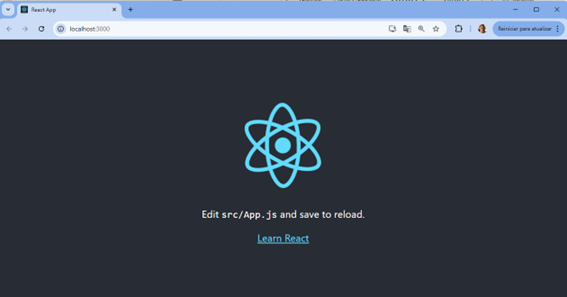
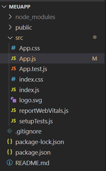

# Aula 1
Conceito: criar um aplicativo básico em React com a criação das rotas para páginas

## Passo 1 - criação do projeto:
No prompt de comando, digite o comando:

```bash
npx create-react-app meuapp
```

Depois que ele for executado, você deverá entrar na pasta do projeto:

```bash
cd meuapp
```

Instalar o pacote de roteamento:

```bash
npm install react-router-dom
```

E através do comando:

```bash
code .
```

Que vai abrir o editor VSCode para editar os arquivos.

Também já execute o comando:

```bash
npm start
```

Ele vai iniciar o servidor, carregando a aplicação no seu navegador através de um endereço que no padrão é: `localhost:3000`

Caso tudo isso dê certo, você verá a seguinte tela no seu navegador:



Observações:   
Em caso de erros no passo inicial, checar se na pasta do seu usuário no Windows existe uma pasta appdata/roaming/npm, caso ela não existir, crie sem nenhum item dentro.

## Passo 2 - Modificando o projeto base

O projeto base que foi criado possui a seguinte estrutura


Teremos que criar 2 novas pastas dentro de Src:  
- components   
- pages   
   
Dentro de Components, crie 2 arquivos:   
- Navbar.css   
- Navbar.jsx   
   
Dentro de pages, crie 3 arquivos:   
- About.jsx   
- Contact.jsx   
- Home.jsx   

Agora teremos que colocar o código em cada um dos arquivos:  
Arquivo: Navbar.jsx   
[Ver código completo](./meu-app-router/src/components/Navbar.jsx)

Arquivo: Navbar.css   
[Ver código completo](./meu-app-router/src/components/Navbar.css)

Arquivo: About.jsx   
[Ver código completo](./meu-app-router/src/pages/About.jsx)

Arquivo: Contact.jsx   
[Ver código completo](./meu-app-router/src/pages/Contact.jsx)

Arquivo: Home.jsx   
[Ver código completo](./meu-app-router/src/pages/Home.jsx)

Feito isso, agora só falta implementar as mudanças no arquivo App.js o qual já foi criado baseado no template, mas que deve ser modificado ficando assim:   
Arquivo: App.js   
[Ver código completo](./meu-app-router/src/App.js)


Neste arquivo está o ponto mais importante, pois vemos que estão sendo criadas as rotas que apontam para os endereços das páginas   
Rota	Componente
/	Home
/about	About
/contact	Contact

Vemos no topo que os comandos “import” estão incluindo os componentes criados nos arquivos Home.jsx, About.jsx e Contact.jsx para serem referência nos comandos “Route” , assim como o componente “Navbar” que é o menu da aplicação.
```bash
import Navbar from './components/Navbar';
import Home from './pages/Home';
import About from './pages/About';
import Contact from './pages/Contact';
```

Vemos no layout que o componente “<Navbar />” inserido no corpo do App.js é o responsável pela exibição do menu da aplicação.


## Trecho gerado pelo NPM

# Getting Started with Create React App

This project was bootstrapped with [Create React App](https://github.com/facebook/create-react-app).

## Available Scripts

In the project directory, you can run:

### `npm start`

Runs the app in the development mode.\
Open [http://localhost:3000](http://localhost:3000) to view it in your browser.

The page will reload when you make changes.\
You may also see any lint errors in the console.

### `npm test`

Launches the test runner in the interactive watch mode.\
See the section about [running tests](https://facebook.github.io/create-react-app/docs/running-tests) for more information.

### `npm run build`

Builds the app for production to the `build` folder.\
It correctly bundles React in production mode and optimizes the build for the best performance.

The build is minified and the filenames include the hashes.\
Your app is ready to be deployed!

See the section about [deployment](https://facebook.github.io/create-react-app/docs/deployment) for more information.

### `npm run eject`

**Note: this is a one-way operation. Once you `eject`, you can't go back!**

If you aren't satisfied with the build tool and configuration choices, you can `eject` at any time. This command will remove the single build dependency from your project.

Instead, it will copy all the configuration files and the transitive dependencies (webpack, Babel, ESLint, etc) right into your project so you have full control over them. All of the commands except `eject` will still work, but they will point to the copied scripts so you can tweak them. At this point you're on your own.

You don't have to ever use `eject`. The curated feature set is suitable for small and middle deployments, and you shouldn't feel obligated to use this feature. However we understand that this tool wouldn't be useful if you couldn't customize it when you are ready for it.

## Learn More

You can learn more in the [Create React App documentation](https://facebook.github.io/create-react-app/docs/getting-started).

To learn React, check out the [React documentation](https://reactjs.org/).

### Code Splitting

This section has moved here: [https://facebook.github.io/create-react-app/docs/code-splitting](https://facebook.github.io/create-react-app/docs/code-splitting)

### Analyzing the Bundle Size

This section has moved here: [https://facebook.github.io/create-react-app/docs/analyzing-the-bundle-size](https://facebook.github.io/create-react-app/docs/analyzing-the-bundle-size)

### Making a Progressive Web App

This section has moved here: [https://facebook.github.io/create-react-app/docs/making-a-progressive-web-app](https://facebook.github.io/create-react-app/docs/making-a-progressive-web-app)

### Advanced Configuration

This section has moved here: [https://facebook.github.io/create-react-app/docs/advanced-configuration](https://facebook.github.io/create-react-app/docs/advanced-configuration)

### Deployment

This section has moved here: [https://facebook.github.io/create-react-app/docs/deployment](https://facebook.github.io/create-react-app/docs/deployment)

### `npm run build` fails to minify

This section has moved here: [https://facebook.github.io/create-react-app/docs/troubleshooting#npm-run-build-fails-to-minify](https://facebook.github.io/create-react-app/docs/troubleshooting#npm-run-build-fails-to-minify)
