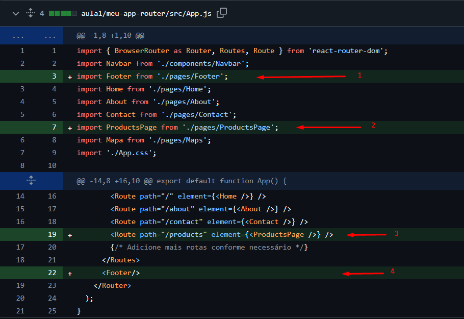
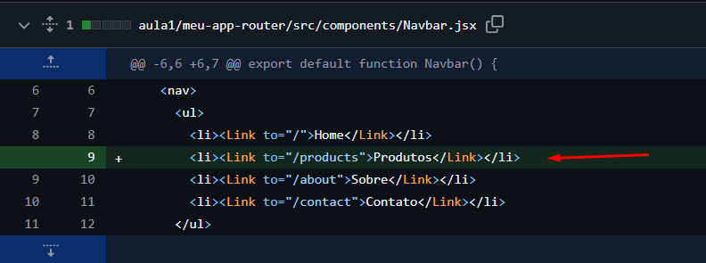
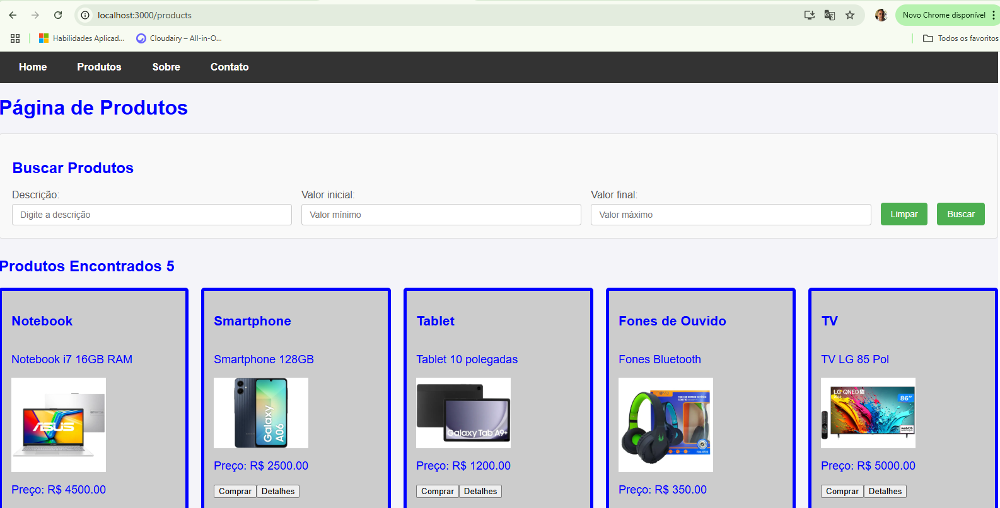

Passo 2: Criação de componentes

O site terá a inclusão de uma nova página no menu, será a página de produtos, por isso iremos incluir alguns arquivos e realizar modificações no que já foi feito previamente.

Para iniciar o processo, podemos criar alguns arquivos novos que são:  
Na pasta src/components:   
    
ProductItem.jsx  
Este código é referente ao componente que monta cada produto na tela, ele será utilizado para padronizar os produtos exibidos e será chamado num loop quando carregar os produtos.  
[Ver código completo](../aula1/meu-app-router/src/components/ProductItem.jsx)  

ProductItem.module.css  
Este código é referente ao CSS do ProductItem.jsx onde ele é importado no topo do arquivo   
[Ver código completo](../aula1/meu-app-router/src/components/ProductItem.module.css)  
    
ProductList.jsx  
Este código é referente ao componente que lista os produtos na tela, ele vai utilizar o componente ProductItem.jsx para renderizar cada produto que será exibido.   
[Ver código completo](../aula1/meu-app-router/src/components/ProductList.jsx)  
    
ProductList.module.css  
Este código é referente ao CSS do ProductList.jsx onde ele é importado no topo do arquivo   
[Ver código completo](../aula1/meu-app-router/src/components/ProductList.module.css)  

ProductSearch.jsx  
Este código é referente ao quadro de pesquisa de produtos disposto no topo da página de produtos   
[Ver código completo](../aula1/meu-app-router/src/components/ProductSearch.sx)  

ProductSearch.module.css  
Este código é referente ao CSS do ProductSearch.jsx onde ele é importado no topo do arquivo   
[Ver código completo](../aula1/meu-app-router/src/components/ProductSearch.module.css)  
  
Na pasta src/pages:  

ProductsPage.jsx  
Esta é a página de produtos do site, ela irá orquestrar a montagem dos componentes responsáveis pela exibição de produtos, nesta versão ela está trazendo produtos fictícios.
[Ver código completo](../aula1/meu-app-router/src/pages/ProductsPage.jsx)  

Footer.jsx  
Esta página é referente ao rodapé do site.
[Ver código completo](../aula1/meu-app-router/src/components/Footer.jsx)    
  
Depois teremos que modificar arquivos que já existem:  

App.js  
  

Explicando as alterações: 
Veja que no arquivo app.js (1,2) as modificações apontadas pelas setas mostram que foram incluídas no topo, referências para inclusão da página Footer e ProductsPage.   
Depois no conteúdo html, veja que foi incluído no menu a rota para ProductsPage.
Além disso ao final, foi incluído o Footer através da tag. 

components/Navbar.jsx  
  
Explicando as alterações:  
Incluindo uma linha para o menu.  

Como o site ficará quando estiver pronto:

Layout da página inicial:   
  

Layout da página de produtos:
  

