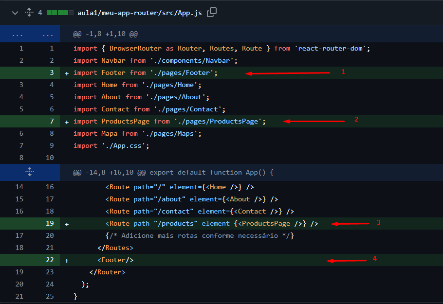
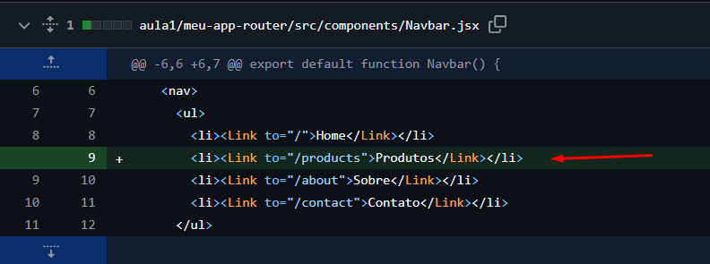

Passo 2: Criação de componentes

O site terá a inclusão de uma nova página no menu, será a página de produtos, por isso iremos incluir alguns arquivos e realizar modificações no que já foi feito previamente.

Para iniciar o processo, podemos criar alguns arquivos novos que são:  
Na pasta src/components:
    
ProductItem.jsx
[Ver código completo](../aula1/meu-app-router/src/components/ProductItem.jsx)

ProductItem.module.css
[Ver código completo](../aula1/meu-app-router/src/components/ProductItem.module.css)
    
ProductList.jsx
[Ver código completo](../aula1/meu-app-router/src/components/ProductList.jsx)
    
ProductList.module.jsx
[Ver código completo](../aula1/meu-app-router/src/components/ProductList.module.css)

Na pasta src/pages:

ProductsPage.jsx
[Ver código completo](../aula1/meu-app-router/src/pages/ProductsPage.jsx)

Footer.jsx
[Ver código completo](../aula1/meu-app-router/src/components/Footer.jsx)    

Depois teremos que modificar arquivos que já existem:

App.js

Explicando as alterações: 
Veja que no arquivo app.js (1,2) as modificações apontadas pelas setas mostram que foram incluídas no topo, referências para inclusão da página Footer e ProductsPage.   
Depois no conteúdo html, veja que foi incluído no menu a rota para ProductsPage.
Além disso ao final, foi incluído o Footer através da tag. 

components/Navbar.jsx

